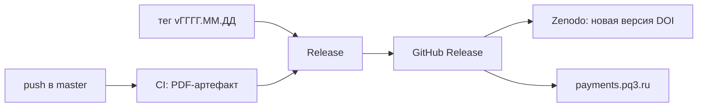

# Инженерия платежей

[](https://doi.org/10.5281/zenodo.19884844)

Исходники книги о карточных платежах, СБП и платёжной инфраструктуре.
Актуальный PDF - на [payments.pq3.ru](https://payments.pq3.ru/).
Примеры из книги и их проверка (python) - в [samples/](samples/README.md).

## Нашли ошибку?

Поправки приветствуются. Сообщить: [issue по шаблону errata](https://github.com/danilkiff/payments-book/issues/new/choose). 
Что приложить и как опираться на источники — в [CONTRIBUTING.md](CONTRIBUTING.md). 
Подтверждённые ошибки — в [ERRATA.md](ERRATA.md).

## Сборка

Нужны TeX Live с latexmk и biber, Inkscape, шрифт Inter и Python 3 с Pillow; pre-commit хуку - tex-fmt и chktex, `make site` - poppler-utils и шрифт PT Sans.
CI собирает в образе `ghcr.io/xu-cheng/texlive-full`.

```bash
make init    # pre-commit: tex-fmt и chktex для .tex, lint_svg.py для SVG
make pdf     # build/payments-book.pdf
make check   # chktex и сверка метаданных, то же проверяет CI
```

Параллельные сборки ломают общие aux и bcf, серия сборок идёт через `scripts/build.sh` (lock вокруг `make pdf`).

Генерируемые файлы руками не правятся:

- `src/frontmatter/cover.tex` - источник `scripts/figures/gen_cover.py`;
- SVG с парным `scripts/figures/gen_<name>.py` - источник этот скрипт, канон рисунков в [assets/figures/README.md](assets/figures/README.md);
- PDF рисунков и `src/gitversion.tex` создаёт `make pdf`, в git они не входят;

## Метаданные

`src/meta.tex` задаёт название, подзаголовок, автора, DOI и ORCID для обложки, оборота титула и свойств PDF.
Их копии в `.zenodo.json`, `CITATION.cff`, README и `scripts/zenodo-publish.py` сверяет `scripts/check-meta.py`: при смене правится `src/meta.tex`, проверка перечисляет копии с расхождением.

Аннотация и ключевые слова для Zenodo и сайта - в `.zenodo.json`; аннотация в `CITATION.cff` - копия без сверки.

Сайт берёт название, подзаголовок, автора и оглавление с номерами страниц из PDF релиза, выдержку из предисловия и рисунок - из исходников того же тега.

## Релиз



1. Коммит в master, CI зелёный;
2. Тег `vГГГГ.ММ.ДД` на этот коммит и `git push origin <тег>`; второй тег за день сайт не соберёт, `scripts/gen-site.py` берёт дату из тега;
3. В GitHub Release автосписок PR заменяется описанием изменений для читателя;

Release берёт PDF из CI того же коммита, при упавшем CI или ожидании дольше 15 минут собирает сам.
Сбой Zenodo или сайта перезапускается без нового релиза: `gh workflow run zenodo.yml -f tag=<тег>`, так же `site.yml`.

Секреты репозитория: `ZENODO_TOKEN` (scope deposit:write и deposit:actions), `SSH_HOST`, `SSH_USER` и `SSH_KEY` сервера сайта; раскладка каталогов на сервере - в [site.yml](.github/workflows/site.yml).

## Лицензия

Текст книги распространяется на условиях [CC BY-NC 4.0](LICENSE).
